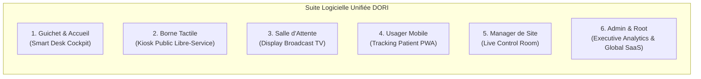
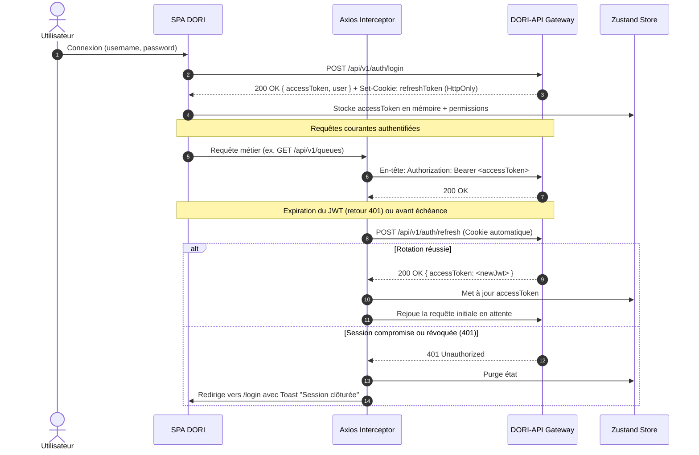
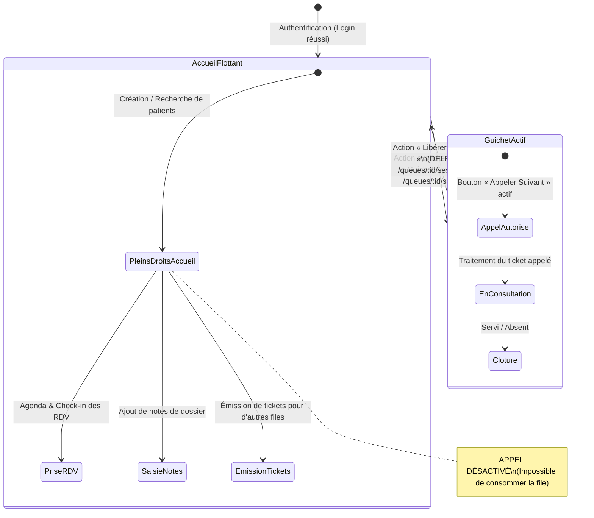

# Spécification Fonctionnelle & Technique Détaillée du Front-End (SFD Front) — DORI SaaS

> **Projet** : Plateforme Front-End DORI (Solution SaaS Internationale de Gestion des Files d'Attente & d'Accueil Patient)  
> **Type de Solution** : SaaS Multi-Sites, Multi-Pays, Multi-Devises  
> **API de Référence** : DORI-API v1.0.0 (NestJS 10 / PostgreSQL 15+ / WebSockets / TypeORM natif)  
> **Documents associés** : [`ai/sfd.md`](./sfd.md) (SFD Backend) et [`ai/codex_handover.md`](./codex_handover.md)  
> **Emplacement du document** : `/ai/spec_front.md`  
> **Date de référence** : Octobre 2026 — Version 3.1.0 finale, alignée sur l'API vérifiée

---

## Sommaire Exécutif

1. [Vision Produit SaaS & Typologie des Applications](#1-vision-produit-saas--typologie-des-applications)
   - 1.1 [Positionnement & Ambition Commerciale](#11-positionnement--ambition-commerciale)
   - 1.2 [Architecture Multi-Sites, Multi-Pays & Multi-Devises](#12-architecture-multi-sites-multi-pays--multi-devises)
   - 1.3 [Déclinaison des 6 Espaces Applicatifs par Persona](#13-déclinaison-des-6-espaces-applicatifs-par-persona)
2. [Architecture Technique Front-End & Principes Directeurs](#2-architecture-technique-front-end--principes-directeurs)
   - 2.1 [Stack Technologique de Référence](#21-stack-technologique-de-référence)
   - 2.2 [Gestion d'État, Cache & Résilience Réseau](#22-gestion-détat-cache--résilience-réseau)
   - 2.3 [Sécurité Zero-Trust, Authentification & Refresh Silencieux](#23-sécurité-zero-trust-authentification--refresh-silencieux)
   - 2.4 [Moteur Temps Réel Événementiel (WebSockets Socket.IO)](#24-moteur-temps-réel-événementiel-websockets-socketio)
   - 2.5 [Internationalisation Réactive (i18n & Support RTL)](#25-internationalisation-réactive-i18n--support-rtl)
   - 2.6 [Design System, Micro-Interactions & Command Palette (`Cmd+K`)](#26-design-system-micro-interactions--command-palette-cmdk)
3. [Matrice Fine d'Habilitations (Fine-Grained RBAC) & Anti-Escalade](#3-matrice-fine-dhabilitations-fine-grained-rbac--anti-escalade)
   - 3.1 [Découpage des Rangs (1 à 5) & Philosophie de Droit](#31-découpage-des-rangs-1-à-5--philosophie-de-droit)
   - 3.2 [Composant Gardien d'Habilitation (`<Can />`)](#32-composant-gardien-dhabilitation-can-)
   - 3.3 [Switcher de Périmètre Territorial Intelligent (Site & File)](#33-switcher-de-périmètre-territorial-intelligent-site--file)
   - 3.4 [Garde-fous Visuels Anti-Escalade de Pouvoir](#34-garde-fous-visuels-anti-escalade-de-pouvoir)
4. [Espace Guichet & Accueil : Smart Desk Cockpit Augmenté](#4-espace-guichet--accueil--smart-desk-cockpit-augmenté)
   - 4.1 [Règle Métier Fondamentale : Les Deux États de l'Hôtesse Connectée](#41-règle-métier-fondamentale--les-deux-états-de-lhôtesse-connectée)
   - 4.2 [Maquettes Comparatives : Avant et Après Occupation du Guichet](#42-maquettes-comparatives--avant-et-après-occupation-du-guichet)
   - 4.3 [Pilotage de Guichet : Occupation, Appel et Libération](#43-pilotage-de-guichet--occupation-appel-et-libération)
   - 4.4 [Fiche Personne & Notes Sécurisées](#44-fiche-personne--notes-sécurisées)
   - 4.5 [Fast Registration Desk (Création Éclair & Déduplication Téléphonique)](#45-fast-registration-desk-création-éclair--déduplication-téléphonique)
   - 4.6 [Agenda Visuel de Rendez-vous, Prise de RDV & Check-in 1-Clic](#46-agenda-visuel-de-rendez-vous-prise-de-rdv--check-in-1-clic)
   - 4.7 [Récapitulatif de Passage & Impression](#47-récapitulatif-de-passage--impression)
5. [Espace Borne : Borne Tactile Libre-Service Nouvelle Génération (Kiosk)](#5-espace-borne--borne-tactile-libre-service-nouvelle-génération-kiosk)
   - 5.1 [Design Kiosk Immersif & Accessibilité Universelle](#51-design-kiosk-immersif--accessibilité-universelle)
   - 5.2 [Parcours Rendez-vous Express (Scan QR Code ou Informations du RDV)](#52-parcours-rendez-vous-express-scan-qr-code-ou-informations-du-rdv)
   - 5.3 [Parcours Sans Rendez-vous (Orientation & Forfaits Payants)](#53-parcours-sans-rendez-vous-orientation--forfaits-payants)
   - 5.4 [Génération de Ticket Numérique & Impression Thermique](#54-génération-de-ticket-numérique--impression-thermique)
   - 5.5 [Gestion de la Sécurité, Watchdog d'Inactivité & Confidentialité](#55-gestion-de-la-sécurité-watchdog-dinactivité--confidentialité)
6. [Espace Salle d'Attente : Affichage Dynamique Broadcast (Display TV)](#6-espace-salle-dattente--affichage-dynamique-broadcast-display-tv)
   - 6.1 [Disposition Visuelle 4K/1080p & Normes Broadcast](#61-disposition-visuelle-4k1080p--normes-broadcast)
   - 6.2 [Zone Héros d'Appel, Effets d'Onde & Animations Pulsées](#62-zone-héros-dappel-effets-donde--animations-pulsées)
   - 6.3 [Moteur Audio & Synthèse Vocale Multilingue (Chime + Web Speech)](#63-moteur-audio--synthèse-vocale-multilingue-chime--web-speech)
   - 6.4 [Garantie d'Anonymisation Stricte (Zéro PII)](#64-garantie-danonymisation-stricte-zéro-pii)
7. [Espace Usager Final : Web App Patient & Tracking Smartphone Temps Réel](#7-espace-usager-final--web-app-patient--tracking-smartphone-temps-réel)
   - 7.1 [Accès Zéro Friction par Token Opaque (PWA Responsive)](#71-accès-zéro-friction-par-token-opaque-pwa-responsive)
   - 7.2 [Jauge Circulaire Interactive & Temps d'Attente Prédictif](#72-jauge-circulaire-interactive--temps-dattente-prédictif)
   - 7.3 [Écran d'Alerte Immersive « C'est votre tour ! » (Vibreur & Son)](#73-écran-dalerte-immersive-cest-votre-tour--vibreur--son)
8. [Espace Manager de Site : Live Control Room & Supervision Opérationnelle](#8-espace-manager-de-site--live-control-room--supervision-opérationnelle)
   - 8.1 [Live Control Room (Salle de Contrôle Temps Réel)](#81-live-control-room-salle-de-contrôle-temps-réel)
   - 8.2 [Alertes Proactives de Dépassement SLA (> 20 min d'attente)](#82-alertes-proactives-de-dépassement-sla--20-min-dattente)
   - 8.3 [Procédure de Forçage de Reset Sécurisé](#83-procédure-de-forçage-de-reset-sécurisé)
9. [Espace Administrateur d'Établissement / Groupe : Analytics & Configuration](#9-espace-administrateur-détablissement--groupe--analytics--configuration)
   - 9.1 [Dashboard Exécutif Inter-Sites (KPIs, TMA, TMT, No-Show)](#91-dashboard-exécutif-inter-sites-kpis-tma-tmt-no-show)
   - 9.2 [Simulateur de Capacité & Dimensionnement de Files](#92-simulateur-de-capacité--dimensionnement-de-files)
   - 9.3 [Wizards d'Onboarding de Sites & Files d'Attente](#93-wizards-donboarding-de-sites--files-dattente)
   - 9.4 [Studio des Forfaits & Tarification Multi-Devises](#94-studio-des-forfaits--tarification-multi-devises)
   - 9.5 [Studio de Notification : Règles de Déclenchement & Suivi Outbox](#95-studio-de-notification--règles-de-déclenchement--suivi-outbox)
   - 9.6 [Annuaire Utilisateurs & Attribution des Rôles Anti-Escalade](#96-annuaire-utilisateurs--attribution-des-rôles-anti-escalade)
   - 9.7 [Studio de Traduction Dynamique (i18n Live Hot-Reload)](#97-studio-de-traduction-dynamique-i18n-live-hot-reload)
10. [Espace Super-Admin (Root) : SaaS Master Cockpit Multi-Pays](#10-espace-super-admin-root--saas-master-cockpit-multi-pays)
    - 10.1 [Vue globale des sites](#101-vue-globale-des-sites)
    - 10.2 [Santé de l'API](#102-santé-de-lapi)
11. [Cartographie des Écrans, Routes Front-End & Contrats d'API](#11-cartographie-des-écrans-routes-front-end--contrats-dapi)
12. [Directives d'Implémentation & Checklist Développeur](#12-directives-dimplémentation--checklist-développeur)
13. [Contrats fonctionnels par espace](#13-contrats-fonctionnels-par-espace)
14. [Critères d'Acceptation Transverses](#14-critères-dacceptation-transverses)

---

## 1. Vision Produit SaaS & Typologie des Applications

### 1.1 Positionnement & Ambition Commerciale

DORI est conçu comme un **progiciel SaaS d'hospitalité et de régulation de flux usagers de nouvelle génération**, commercialisable à l'international sous forme d'abonnement multi-établissements auprès :

- Des groupes hospitaliers publics et privés (cliniques, CHU, polycliniques).
- Des réseaux de laboratoires d'analyses médicales et de centres d'imagerie.
- Des administrations publiques, consulats et centres de visas recevant des flux tendus de citoyens.
- Des institutions financières et agences bancaires prestigieuses nécessitant des parcours VIP segmentés.

Le produit combine une ergonomie SaaS moderne, des micro-interactions utiles et une forte résilience réseau. Les lectures et préférences locales peuvent être optimistes; les commandes métier concurrentes ou irréversibles (`next`, reset, prise de relais, clôture) attendent toujours la confirmation serveur.

### 1.2 Architecture Multi-Sites, Multi-Pays & Multi-Devises

Pour opérer sans friction dans des environnements hétérogènes (ex. chaîne de cliniques répartie entre la France, la Tunisie, le Maroc et les Émirats Arabes Unis) :

- **Multi-Fuseaux Horaires IANA Natif** : Chaque site physique possède son fuseau horaire propre (`timezone`, ex. `Europe/Paris`, `Africa/Tunis`, `Asia/Dubai`). L'ensemble des horodatages affichés dans l'IHM s'adaptent automatiquement au fuseau du site actif, et non à l'horloge locale du navigateur de l'utilisateur.
- **Multi-Devises ISO-4217 & Tarification Héritée** : Chaque établissement définit sa devise maîtresse (`default_currency`, ex. `EUR`, `TND`, `USD`, `AED`). Les forfaits de service peuvent surcharger cette devise ou en hériter dynamiquement avec formatage localisé des montants (séparateurs décimaux et symboles monétaires adaptés).
- **Internationalisation Locale Téléphonique E.164** : Les champs de saisie téléphonique intègrent un sélecteur d'indicatif pays automatique avec recherche rapide et drapeau, normalisant rigoureusement chaque numéro selon la norme E.164 (`+33...`, `+216...`, `+212...`).
- **White-Labeling** : le nom et le logo du site (`site_logo_url`) personnalisent les écrans du site.

### 1.3 Déclinaison des 6 Espaces Applicatifs par Persona



---

## 2. Architecture Technique Front-End & Principes Directeurs

### 2.1 Stack Technologique de Référence

Le front-end est architecturé autour d'un socle technique moderne garantissant des performances maximales :

| Rôle                       | Technologie                              | Justification Opérationnelle                                                                   |
| :------------------------- | :--------------------------------------- | :--------------------------------------------------------------------------------------------- |
| **Framework Base**         | React 18+ (Vite ou Next.js 14+ SPA mode) | Réactivité déclarative, Virtual DOM optimisé, composabilité.                                   |
| **Langage**                | TypeScript 5.4+ (Strict Mode)            | Typage statique intégral de tous les DTOs API, zéro `any`.                                     |
| **Gestion d'État Serveur** | TanStack Query v5 (React Query)          | Cache automatique, synchronisation en arrière-plan, refetch sur reconnexion.                   |
| **Gestion d'État Client**  | Zustand                                  | Store ultra-léger pour la session, le périmètre actif et les préférences UI.                   |
| **Passerelle Temps Réel**  | `socket.io-client` 4.7+                  | Abonnements événementiels aux rooms, reconnexion avec backoff exponentiel.                     |
| **UI & Composants**        | TailwindCSS + Radix UI Primitives        | Contrôle total du rendu, design tokens sur mesure, accessibilité clavier et screen readers.    |
| **Icônes & Visuels**       | Lucide Icons                             | Pack vectoriel harmonieux, léger et personnalisable.                                           |
| **Formulaires & Schémas**  | React Hook Form + Zod                    | Validation instantanée côté client alignée sur les DTOs backend (`class-validator`).           |
| **Graphiques & DataViz**   | Tremor / Recharts                        | Tableaux de bord financiers et de flux interactifs haute résolution.                           |
| **Moteur Audio**           | Web Audio API                            | Synthèse sonore personnalisée (_chime_ binaural haute fidélité) sans latence de fichier audio. |

### 2.2 Gestion d'État, Cache & Résilience Réseau

L'application organise son état en 4 couches distinctes :

1. **État d'Authentification & Rôles (`useAuthStore`)** : Stocke l'access token JWT court, les rôles, permissions et rangs de l'utilisateur.
2. **État de Périmètre Territorial (`useScopeStore`)** : Mémorise le `siteId` actif, le `queueId` sélectionné et le `threadNumber` (numéro de guichet) de l'opérateur.
3. **Cache Réseau & Optimistic Updates (`TanStack Query`)** :  
   Lors de l'appel d'un ticket (`POST /next`) ou de la clôture (`POST /served`), l'IHM met à jour son interface **instantanément** avant même le retour serveur, puis réconcilie l'état dès confirmation de la transaction.
4. **État Événementiel de File (`useLiveQueueStore`)** : Réceptionne les événements du WebSocket et mute le cache local pour actualiser la position des tickets sans aucun appel réseau redondant.

### 2.3 Sécurité Zero-Trust, Authentification & Refresh Silencieux



### 2.4 Moteur Temps Réel Événementiel (WebSockets Socket.IO)

La couche WebSocket centralisée (`useRealtimeSocket`) gère le cycle de vie de la communication bidirectionnelle :

- **Abonnement Contextuel Dynamique** :  
  Dès que l'opérateur sélectionne une file ou que la borne démarre, le front déclenche :
  ```ts
  socket.emit('subscribe', { room: `queue:${queueId}:ops` });
  ```
- **Ping de Vitalité Opérateur (_Keep-Alive Touch_)** :  
  Si l'opérateur a une session active sur un guichet, un timer régulier déclenche toutes les 30 secondes :
  ```ts
  socket.emit('ping_session', { queueId, sessionId });
  ```
  mettant à jour `last_seen_at` en base sans latence HTTP.
- **Récupération Instantanée post-Déconnexion** :  
  Sur l'événement `socket.on('reconnect')`, le client réémet immédiatement ses abonnements et déclenche un refetch silencieux de l'état de la file (`invalidateQueries(['queue-status', queueId])`).

### 2.5 Internationalisation Réactive (i18n & Support RTL)

- **Chargement Universel du Bundle** : Au premier démarrage, l'application appelle `GET /api/v1/translations/bundle?category=ihm&locale=fr`.
- **Bascule Bilingue & RTL Dynamique** :  
  Lors du passage à la langue arabe (`locale = 'ar'`), le document bascule instantanément son attribut directionnel `document.documentElement.dir = 'rtl'`, réordonnant l'ensemble des grilles Flexbox/CSS sans cassure visuelle.
- **Hot-Reload en Temps Réel** :  
  Sur réception du message WebSocket `translation_cache_invalidated`, l'IHM recharge le bundle en tâche de fond et actualise immédiatement tous les libellés sans rafraîchissement d'écran.

### 2.6 Design System, Micro-Interactions & Command Palette (`Cmd+K`)

Pour satisfaire aux attentes des opérateurs intensifs et offrir un produit commercial à fort effet « Waouh » :

- **Command Palette Universelle (`Cmd+K` / `Ctrl+K`)** : Accessible partout dans l'application pour les secrétaires et managers :
  - _« Appeler le ticket suivant »_
  - _« Rechercher le patient Karim... »_
  - _« Basculer vers la file Pédiatrie »_
  - _« Créer un nouveau rendez-vous »_
  - _« Ouvrir le guichet 3 »_
- **Raccourcis Clavier Guichet Haute Efficacité** :  
  `Espace` (Appeler suivant), `Entrée` (Valider terminé), `Échap` (Marquer absent) et `N` (Nouveau ticket rapide).
- **Thème Sombre & Thème Clair (Dark/Light Mode)** : Adaptabilité visuelle automatique selon l'environnement de la clinique ou le choix de l'opérateur.
- **Navigation latérale en accordéon** : Les catégories Opérations, Expériences et Administration n’apparaissent que si elles contiennent au moins un écran autorisé. Une seule catégorie est ouverte à la fois et celle de la route active s’ouvre automatiquement. Le lien `Mentions légales · Confidentialité`, indépendant des catégories, reste toujours ancré tout en bas du bandeau latéral.

---

## 3. Matrice Fine d'Habilitations (Fine-Grained RBAC) & Anti-Escalade

### 3.1 Découpage des Rangs (1 à 5) & Philosophie de Droit

Chaque utilisateur connecté possède un rang maximal (`maxRank`) dérivé de ses rôles actifs en base :

```
[Rang 5 — Root]      ❯ Supervision SaaS globale, tous sites, gestion technique complète.
[Rang 4 — Admin]     ❯ Administration d'entreprise/réseau de cliniques, gestion des managers.
[Rang 3 — Manager]   ❯ Responsable d'un ou plusieurs sites, supervision des files, rapports.
[Rang 2 — Opérateur] ❯ Secrétaire, hôtesse d'accueil, guichetier, médecin.
[Rang 1 — Kiosk]     ❯ Compte technique autonome de la borne tactile.
```

### 3.2 Composant Gardien d'Habilitation (`<Can />`)

L'ensemble des boutons, menus et vues s'articule autour d'un composant déclaratif d'autorisation :

```tsx
<Can permission="registration_call" queueId={activeQueueId}>
  <Button onClick={handleCallNext} variant="primary">
    Appeler Suivant
  </Button>
</Can>
```

Si l'utilisateur ne possède pas la permission requise ou si la ressource est hors de son périmètre territorial (`Scope`), le composant est soit masqué, soit rendu dans un état désactivé avec infobulle pédagogique.

### 3.3 Switcher de Périmètre Territorial Intelligent (Site & File)

Dans le bandeau supérieur de l'application :

- **Sélecteur de Site** : Affiche la liste des sites autorisés (`user.sites`). Affiche un badge coloré indiquant le fuseau horaire et le nombre de guichets actifs.
- **Sélecteur de File** : Filtre instantanément les files d'attente rattachées au site choisi avec visualisation en temps réel du nombre d'usagers en attente (`badge count`).
- **Garde de Conflit de Session** : si un opérateur tente de changer de file alors qu'il a un ticket en cours (`in_progress`), une modale bloquante lui impose de clôturer le ticket puis de libérer le guichet.

### 3.4 Garde-fous Visuels Anti-Escalade de Pouvoir

Dans les modules de gestion des utilisateurs :

1. **Contrôle de Rang Strict (`callerMaxRank > targetMaxRank`)** :  
   Un utilisateur ne peut pas visualiser les actions d'édition sur un pair de rang identique ou supérieur. Exemple : un manager (rang 3) voit les boutons d'action désactivés pour tous les autres comptes de rang 3, 4 et 5.
2. **Plafond Dynamique des Rôles Attribuables** :  
   La liste déroulante des rôles lors de la création d'un collaborateur filtre rigoureusement les profils pour interdire l'attribution d'un rôle supérieur au rang permis par les permissions de l'opérateur.

---

## 4. Espace Guichet & Accueil : Smart Desk Cockpit Augmenté

### 4.1 Règle Métier Fondamentale : Les Deux États de l'Hôtesse Connectée

Lorsqu'une hôtesse, secrétaire ou opératrice se connecte à l'application (`POST /auth/login`), **elle n'est rattachée à aucun guichet physique par défaut**. Elle entre dans un état dit **« Mode Accueil Flottant / Consultation »** :



1. **État A : Mode « Accueil Flottant » (Par défaut à la connexion)** :
   - L'hôtesse dispose de **l'intégralité de ses permissions administratives et de saisie** : recherche de dossiers, création de nouvelles fiches personnes (`POST /persons`), ajout de notes internes (`POST /persons/:id/notes`), émission de tickets (`POST /registrations`), enregistrement de présences (_check-in_) et planification de rendez-vous dans l'agenda.
   - En revanche, elle **ne peut pas appeler d'usagers ni faire avancer la file d'attente** : le bouton « Appeler Suivant » est grisé et verrouillé avec l'infobulle : _« 🔒 Vous devez d'abord occuper un guichet physique pour appeler les usagers de cette file »_.
   - Aucun guichet n'est bloqué indûment sur les écrans TV de la salle ou dans le dashboard du manager.
2. **État B : Mode « Guichet Actif » (Consommation & Appel de la file)** :
   - Pour commencer à appeler, l'hôtesse choisit un guichet libre (ex. _Guichet 2_) dans le sélecteur et clique sur le bouton bien visible **« [ 🪑 Occuper le Guichet 2 ] »**.
   - L'IHM déclenche l'appel API `POST /api/v1/queues/:queueId/sessions` (`threadNumber: 2`, `mode: 'active'`).
   - Dès confirmation, le poste bascule à l'état **occupé** : le bouton « Appeler Suivant » devient actif, la session apparaît sur la Live Control Room et les actions `next`, `served` et `no-show` sont disponibles.
3. **Libération du Guichet (« Quitter le Poste »)** :
   - Lorsqu'elle s'absente, change de tâche ou termine son service d'appel, l'hôtesse clique sur **« [ 🚪 Libérer le Guichet ] »** (`DELETE /api/v1/queues/:queueId/sessions/:sessionId`).
   - Elle redevient immédiatement en mode « Accueil Flottant » sans être déconnectée de son compte DORI, et le guichet redevient instantanément libre pour ses collègues.

---

### 4.2 Maquettes Comparatives : Avant et Après Occupation du Guichet

#### Vue 1 : À la Connexion — Mode « Accueil Flottant » (Guichet Non Occupé)

```
┌────────────────────────────────────────────────────────────────────────────────────────────────────────────────┐
│ DORI │ 🏢 [ Clinique Pasteur ▼ ] │ 📋 [ Pédiatrie ▼ ] │ 🪑 Guichet : [ Non Assigné ▼ ] │ 🟡 Accueil │ 👤 Sarah B.│
├──────────────────────────────────┬─────────────────────────────────────┬───────────────────────────────────────┤
│ GAUCHE : GUICHET NON OCCUPÉ      │ CENTRE : RECHERCHE & DOSSIER        │ DROITE : ACCUEIL RAPIDE & CALENDRIER  │
│                                  │                                     │                                       │
│ ⚠️ VOUS N'OCCUPEZ AUCUN GUICHET  │ 🔍 Rechercher un dossier patient... │ [ ⚡ + Nouveau Patient / Ticket ]     │
│ Vous êtes en mode accueil seul.  │                                     │                                       │
│                                  │ ┌─────────────────────────────────┐ │ RDV DU JOUR :                         │
│ Pour appeler et consommer la file│ │ Saisir nom ou téléphone E.164   │ │ • 10:15 - Ali K.     [✔️ Check-in]    │
│ d'attente, veuillez sélectionner │ └─────────────────────────────────┘ │ • 10:30 - Sonia M.   [✔️ Check-in]    │
│ un poste disponible :            │                                     │ • 11:00 - Mourad B.  [ En attente ]  │
│                                  │ [ Dossier Patient Karim B. ]        │                                       │
│ Guichet : [ Guichet 2 (Libre) ▼] │ • Tél : +216 98 123 456             │ PROCHAINS EN ATTENTE (5) :            │
│ ┌──────────────────────────────┐ │ • Historique : 2 consultations      │ 1. A015 [RDV]  10:15  Attente: 12m    │
│ │   [ 🪑 OCCUPER CE GUICHET ]  │ │ • Notes : Mutuelle à vérifier       │ 2. A016 [Walk] [♿]   Attente: 18m    │
│ └──────────────────────────────┘ │                                     │ 3. A017 [Walk]        Attente: 14m    │
│                                  │ [ + Ajouter une note interne ]      │ 4. A018 [VIP]         Attente: 06m    │
│ ┌──────────────────────────────┐ │                                     │ 5. A019 [Walk]        Attente: 02m    │
│ │   🔒 [ APPELER SUIVANT ]     │ │                                     │                                       │
│ │  (Occuper guichet d'abord)   │ │                                     │                                       │
│ └──────────────────────────────┘ │                                     │ [ 📅 Voir l'Agenda Complet du Site ]  │
└──────────────────────────────────┴─────────────────────────────────────┴───────────────────────────────────────┘
```

#### Vue 2 : Après Occupation — Mode « Guichet Actif » (Consommation de File Active)

```
┌────────────────────────────────────────────────────────────────────────────────────────────────────────────────┐
│ DORI │ 🏢 [ Clinique Pasteur ▼ ] │ 📋 [ Pédiatrie ▼ ] │ 🪑 Guichet : [ 2 ] │ 🟢 En Service │ 🚪 Libérer │ 👤 Sarah B.│
├──────────────────────────────────┬─────────────────────────────────────┬───────────────────────────────────────┤
│ GAUCHE : PILOTAGE DU GUICHET 2   │ CENTRE : PATIENT AU GUICHET (A014)  │ DROITE : ACCUEIL RAPIDE & CALENDRIER  │
│                                  │                                     │                                       │
│ [ 🪑 GUICHET 2 - EN ACTIVITÉ ]   │ TICKET APPELÉ : A014                │ [ ⚡ + Nouveau Patient / Ticket ]     │
│ Statut : [ 🟢 Occupé ]           │ Forfait : [ 🟡 VIP ]                │                                       │
│ En service depuis : 14 min       │ Niveau de service : [ VIP ]         │ RDV DU JOUR :                         │
│                                  │                                     │ • 10:15 - Ali K.     [✔️ Check-in]    │
│ ┌──────────────────────────────┐ │ IDENTITÉ PATIENT :                  │ • 10:30 - Sonia M.   [✔️ Check-in]    │
│ │      [ APPELER SUIVANT ]     │ │ M. Karim Ben Salem (42 ans)         │                                       │
│ │          (Espace)            │ │ Tél : 🇹🇳 +216 98 123 456            │ PROCHAINS EN ATTENTE (4) :            │
│ └──────────────────────────────┘ │                                     │ 1. A015 [RDV]  10:15  Attente: 12m    │
│ ┌──────────────┬───────────────┐ │ NOTES CONFIDENTIELLES :             │ 2. A016 [Walk] [♿]   Attente: 18m    │
│ │ [ TERMINÉ ]  │ [ ABSENT ]    │ │ 📝 Patient sous oxygénothérapie     │ 3. A017 [Walk]        Attente: 14m    │
│ │  (Entrée)    │  (Échap)      │ │ [+ Ajouter une note interne...]     │ 4. A018 [VIP]         Attente: 06m    │
│ └──────────────────────────────┘ │                                     │ [ 🚪 Libérer le Guichet 2 ]           │
└──────────────────────────────────┴─────────────────────────────────────┴───────────────────────────────────────┘
```

---

### 4.3 Pilotage de Guichet : Occupation, Appel et Libération

- **Bouton « Occuper ce Guichet »** :  
  Déclenche `POST /api/v1/queues/:queueId/sessions` (`threadNumber: X`, `mode: 'active'`). Si le guichet est déjà occupé par un collègue, la modale de conflit avec proposition de prise de relais (_Take Over_) s'ouvre.
- **Bouton « Libérer le Guichet »** :  
  Déclenche `DELETE /api/v1/queues/:queueId/sessions/:sessionId`. Clôture la session guichet sans déconnecter l'utilisateur, et repasse le Cockpit en Mode Accueil Flottant.
- **Détection des RDV en avance (_Early Calls_)** :  
  Si aucun patient à l'heure n'est disponible et qu'un RDV en avance est appelé, un badge doré apparaît : _« RDV Anticipé de 11h00 appelé »_.
- **Score de Priorité Décomposé** :  
  Au survol du badge du ticket, une infobulle expose le calcul exact issu de l'algorithme :
  $$\text{Score } 84.50 = 60\text{ (Base RDV)} + 24.50\text{ (Escalade 24.5 min)}$$
- **États exclusifs du poste** : un guichet est soit **libre**, sans session active, soit **occupé**, avec une session active. Toute interruption ou fin de service libère le guichet via la fermeture de session.

### 4.4 Fiche Personne & Notes Sécurisées

- **Identité & Coordonnées Normalisées** : Affichage du nom, prénom, âge calculé, numéro E.164 avec drapeau du pays et email.
- **Bloc de Notes Confidentielles (`dori_person_note`)** :  
  Historique chronologique des annotations rédigées par les praticiens ou secrétaires. Saisie instantanée via `POST /api/v1/persons/:personId/notes`.

### 4.5 Fast Registration Desk (Création Éclair & Déduplication Téléphonique)

Ce tiroir latéral (_slide-over drawer_) permet d'enregistrer un patient au comptoir en **moins de 20 secondes** :

1. **Recherche Téléphonique Dédupliquée** : Dès la saisie des premiers chiffres, l'IHM interroge `GET /api/v1/persons?search=...`. Si le dossier existe, il est sélectionné en 1 clic.
2. **Création Express** : Saisie nom, prénom, téléphone E.164.
3. **Qualification du Passage** : Choix du motif/file, sélection du forfait (Standard, VIP), type d'entrée (_Walk-in_ ou RDV planifié).
4. **Validation Instantanée (`POST /api/v1/registrations`)** : Génère le numéro de ticket (ex. `A042`) et déclenche le SMS de bienvenue.

### 4.6 Agenda Visuel de Rendez-vous, Prise de RDV & Check-in 1-Clic

- **Calendrier des Créneaux Disponibles** :  
  Consultation en direct de `GET /api/v1/queues/:queueId/availability?date=YYYY-MM-DD`.  
  Grille découpée selon la durée configurée (`slot_duration`, ex. 15 min) avec jauge de capacité restante en vert/orange/rouge.
- **Reprogrammation Assistée (_Reschedule_)** :  
  Déplacement d'un RDV vers un nouveau créneau disponible par simple glisser-déposer ou sélection dans la grille (`POST /registrations/:id/reschedule`).
- **Pointage Rapide d'Arrivée (_Check-in_)** :  
  La liste des RDV du jour affiche un bouton vert **« Pointer l'Arrivée »** (`POST /registrations/:id/check-in`) rendant le patient immédiatement éligible à l'appel.

### 4.7 Récapitulatif de Passage & Impression

À la clôture (`POST /served`), le navigateur peut imprimer un récapitulatif 80 mm avec les seules données confirmées par l'API : site, ticket, file, guichet et horaires disponibles. Ce document est informatif et ne constitue ni une quittance ni un justificatif fiscal signé.

---

## 5. Espace Borne : Borne Tactile Libre-Service Nouvelle Génération (Kiosk)

### 5.1 Design Kiosk Immersif & Accessibilité Universelle

- **Authentification permanente de l'appareil** : avant d'afficher l'accueil, la tablette ouvre une session avec un compte de service `kiosk` limité à son site et à ses files. Ce JWT autorise la création des walk-ins, la recherche de rendez-vous et leur check-in; aucun formulaire de connexion n'est montré à l'usager.
  Conçu pour les totems tactiles (écrans 21 à 32 pouces portrait ou paysage) :
- **Mode Plein Écran Kiosk Immersif** : Désactivation totale de la sélection de texte, du clic droit, du zoom et des barres système.
- **Zones Tactiles Géantes** : Cibles minimales de $64 \times 64 \text{ px}$, contrastes WCAG AAA, polices lisibles à 2 mètres.
- **Bascule Bilingue / Trilingue Instantanée** : Français (`fr`), Arabe (`ar` avec bascule complète en RTL) et Anglais (`en`).

### 5.2 Parcours Rendez-vous Express (Scan QR Code ou Informations du RDV)

La recherche utilise le numéro de ticket ou le couple `lastName` + `scheduledTime`. Le QR encode un critère accepté par ce contrat, sans PII en clair.

1. L'usager appuie sur le bouton géant **« J'ai un Rendez-vous »**.
2. **Identification** :
   - Scan optique du QR code figurant sur sa convocation (SMS ou papier).
   - OU saisie du nom et de l'heure planifiée du rendez-vous.
3. Le système retrouve l'inscription via `GET /registrations/lookup` et affiche uniquement les informations retournées par le contrat.
4. L'usager valide sa présence en 1 clic (`POST /registrations/:id/check-in`). Le ticket d'attente est délivré.

### 5.3 Parcours Sans Rendez-vous (Orientation & Forfaits Payants)

1. L'usager sélectionne **« Je viens sans Rendez-vous »**.
2. **Choix du Service / File** : Grandes tuiles illustrées affichant en direct le temps d'attente estimé (ex. _« ~ 12 minutes »_).
3. **Choix du Forfait** : Affichage transparent des options (ex. _« Standard - Gratuit »_ vs _« Coupe-file Prioritaire - 25.000 TND »_).
4. **Saisie Rapide des Coordonnées** : Pavé numérique tactile pour le téléphone portable et clavier alphabétique pour le nom.

### 5.4 Génération de Ticket Numérique & Impression Thermique

À la validation :

- Affichage plein écran du ticket virtuel : Numéro géant (ex. **A 0 4 2**), file d'attente et position estimée.
- **QR Code Dynamique de Suivi** : Flashable par smartphone pour emporter son ticket.
- **Impression Physique** : Sortie automatique du ticket papier sur imprimante thermique intégrée.
- **Notification SMS Immédiate** : Envoi du SMS contenant le lien de tracking temps réel.

### 5.5 Gestion de la Sécurité, Watchdog d'Inactivité & Confidentialité

- **Watchdog d'Inactivité 30s** : En cas d'abandon de la borne en cours de saisie, un compte à rebours de 15s retentit avec alerte sonore avant réinitialisation complète et effacement de toutes les données saisies.
- **Zéro Stockage Local** : Aucune donnée patient n'est écrite sur le disque local de la borne.

---

## 6. Espace Salle d'Attente : Affichage Dynamique Broadcast (Display TV)

### 6.1 Disposition Visuelle 4K/1080p & Normes Broadcast

Conçu pour fonctionner 24h/24 sans dégradation sur Smart TV (LG WebOS, Samsung Tizen, Android TV, Raspberry Pi HDMI) :

- Format 16:9 haute visibilité avec design épuré, horloge du site et bandeau d'actualité défilant.

### 6.2 Zone Héros d'Appel, Effets d'Onde & Animations Pulsées

Lorsqu'un opérateur appelle un usager (`registration_called`) :

- **Animation d'Onde Concentrique (_Ripple Effect_)** : La zone d'appel clignote avec une animation d'attention haute intensité durant 10 secondes.
- **Affichage Typographique Monumental** : Numéro de ticket (taille 140 pt) et numéro de guichet attribué (taille 80 pt).
- **Historique Récent** : Affichage des 4 derniers tickets appelés dans la colonne de droite.

### 6.3 Moteur Audio & Synthèse Vocale Multilingue (Chime + Web Speech)

- **Carillon Binaural (_Chime_)** : Accord à deux tons généré par Web Audio API à chaque appel.
- **Synthèse Vocale Locale (Text-to-Speech)** : Annonce vocale dynamique dans la langue du site :  
  _« Ticket A-0-1-4, Guichet Numéro 2 »_ (et répétition bilingue en arabe si configuré).

### 6.4 Garantie d'Anonymisation Stricte (Zéro PII)

Connecté à la room WebSocket `queue:<id>:display` : aucune donnée personnelle n'est transmise ni affichée, respectant scrupuleusement le secret médical.

---

## 7. Espace Usager Final : Web App Patient & Tracking Smartphone Temps Réel

### 7.1 Accès Zéro Friction par Token Opaque (PWA Responsive)

Accessible depuis n'importe quel smartphone sans création de compte :

- Lien unique `https://dori.app/track?token=<UUID>` ouvert depuis le QR code du ticket numérique ou imprimé.

### 7.2 Jauge Circulaire Interactive & Temps d'Attente Prédictif

- **Jauge Circulaire Animée SVG** : Visualisation intuitive de l'avancée de la file d'attente.
- **Compteur de Position Dynamique** : « Vous êtes 2ème dans la file ».
- **Compte à Rebours Estimé** : Recalculé en direct à chaque ticket clôturé en amont.

### 7.3 Écran d'Alerte Immersive « C'est votre tour ! » (Vibreur & Son)

Dès l'appel au guichet :

- L'écran devient vert vif clignotant : **« C'EST VOTRE TOUR ! Rendez-vous au GUICHET 2 »**.
- Déclenchement de la vibration du smartphone (`navigator.vibrate`) et signal sonore.

---

## 8. Espace Manager de Site : Live Control Room & Supervision Opérationnelle

### 8.1 Live Control Room (Salle de Contrôle Temps Réel)

La tour de contrôle du responsable d'établissement pour piloter la journée en direct :

```
┌────────────────────────────────────────────────────────────────────────────────────────────────────────────────┐
│ SALLE DE CONTRÔLE EN DIRECT │ 🏥 Clinique Pasteur │ Guichets Actifs : 8/10 │ SLA Global : 🟢 94% Conforme       │
├──────────────────────┬──────────────────────┬──────────────────────┬───────────────────────────────────────────┤
│ TOTAL INSCRITS : 284 │ SERVIS DU JOUR : 212 │ EN ATTENTE : 58      │ TEMPS MOYEN D'ATTENTE : 11 min 20 s       │
├──────────────────────┴──────────────────────┴──────────────────────┴───────────────────────────────────────────┤
│ SUPERVISION DES GUICHETS EN ACTIVITÉ (TEMPS RÉEL) :                                                            │
│                                                                                                                │
│ 🪑 Guichet 1 [Pédiatrie]   │ Sarah B.      │ Ticket en cours : A014 (depuis 06m) │ Statut : 🟢 En Consultation │
│ 🪑 Guichet 2 [Pédiatrie]   │ Dr. Dupont    │ Ticket en cours : A015 (depuis 02m) │ Statut : 🟢 En Consultation │
│ 🪑 Guichet 3 [Générale]    │ —             │ Aucun ticket                         │ Statut : ⚪ Libre           │
│ 🪑 Guichet 4 [Laboratoire] │ Yassine M.    │ Ticket en cours : L008 (depuis 12m) │ Statut : 🟢 En Consultation │
├────────────────────────────────────────────────────────────────────────────────────────────────────────────────┤
│ ALERTES SLA & CHARGE DES FILES D'ATTENTE :                                                                     │
│                                                                                                                │
│ • Consultation Générale : 24 usagers en attente │ Attente max : 22 min │ ⚠️ ALERTE SLA DÉPASSÉ                 │
│   Ouvrir un guichet supplémentaire sur cette file si nécessaire.                                               │
│ • Pédiatrie : 6 usagers en attente │ Attente max : 08 min │ 🟢 Conforme SLA                                    │
│ • Laboratoire : 14 usagers en attente │ Attente max : 14 min │ 🟢 Conforme SLA                                 │
└────────────────────────────────────────────────────────────────────────────────────────────────────────────────┘
```

### 8.2 Alertes Proactives de Dépassement SLA (> 20 min d'attente)

- Détection automatique de tout usager dont le temps d'attente dépasse le seuil configuré.
- Notification sonore discrète et badge clignotant sur l'écran du manager.

### 8.3 Procédure de Forçage de Reset Sécurisé

En cas d'exercice de sécurité, d'incident technique ou de fin de journée imprévue :

- Bouton **« Réinitialisation d'Urgence de la File »** (`POST /api/v1/queues/:queueId/reset`).
- Modale de confirmation explicite affichant la file concernée et les conséquences de l'opération.

---

## 9. Espace Administrateur d'Établissement / Groupe : Analytics & Configuration

### 9.1 Dashboard Exécutif Inter-Sites (KPIs, TMA, TMT, No-Show)

- Comparaison de performance entre tous les sites du groupe.
- Analyse comparative du Temps Moyen d'Attente ($\text{TMA}$) et du Taux de Non-Présentation ($\text{TNP}$).

### 9.2 Simulateur de Capacité & Dimensionnement de Files

Outil interactif d'aide à la décision :

- Le manager saisit le volume attendu de patients et la durée moyenne de consultation souhaitée.
- Le simulateur calcule et recommande le nombre optimal de guichets à ouvrir pour maintenir un temps d'attente inférieur à 15 minutes.

### 9.3 Wizards d'Onboarding de Sites & Files d'Attente

- **Assistant de Création de Site en 4 étapes** : Identité $\to$ Pays/Fuseaux/Devises $\to$ Horaires & Quotas $\to$ Initialisation atomique.
- **Studio de Paramétrage des Files** : Préfixes, capacités maximales, politiques d'escalade d'attente et affectation des opérateurs.

### 9.4 Studio des Forfaits & Tarification Multi-Devises

- Création des paliers de service (`service-tiers`).
- Surcharges de prix et de devises par file d'attente avec désignation du forfait par défaut pour les bornes tactiles.

### 9.5 Studio de Notification : Règles de Déclenchement & Suivi Outbox

- **Éditeur de Règles** : Configuration des alertes `'welcome'` et `'threshold'` (par position ou par temps restant).
- **Simulateur de Rendu SMS** : Mockup de smartphone affichant le texte avec compteur de caractères et découpage en segments GSM (160 car.).
- **Journal Outbox Temps Réel** : Suivi des statuts de remise (`pending`, `delivered`, `failed`) avec bouton de renvoi en 1-clic (`POST /notifications/:id/resend`).
- **Envoi manuel guidé en deux étapes** :
  1. rechercher et sélectionner une personne du site courant (`GET /api/v1/persons`), puis choisir son inscription active ou récente (`GET /api/v1/registrations`) ;
  2. récapituler la personne et l’inscription, choisir `sms` ou `email`, saisir le message et l’éventuel destinataire de substitution, puis appeler `POST /api/v1/notifications`.

  Le payload respecte strictement `SendManualNotificationDto` et contient le `registrationId` sélectionné, jamais un `personId` utilisé comme substitut. Le retour entre les deux étapes conserve le brouillon et l’envoi réussi actualise le journal avec le statut initial `pending`.

### 9.6 Annuaire Utilisateurs & Attribution des Rôles Anti-Escalade

- Gestion des comptes avec validation des mots de passe (10-20 car.).
- Contrôle visuel anti-escalade garantissant qu'un utilisateur ne peut modifier que des collaborateurs de rang strictement inférieur.

### 9.7 Studio de Traduction Dynamique (i18n Live Hot-Reload)

- Édition des textes par catégorie (`ihm`, `sms`, `error`).
- Validation dynamique des variables `{param}` et publication à chaud sans interruption de service.

---

## 10. Espace Super-Admin (Root) : SaaS Master Cockpit Multi-Pays

Ce module est réservé au rôle Root et exploite uniquement son scope global.

### 10.1 Vue globale des sites

- Liste paginée de tous les sites et accès à leur configuration.
- Synthèse globale issue des rapports disponibles, avec filtres par site, file et période supportée.
- Accès aux espaces d'administration des sites, files, tiers, règles, utilisateurs et traductions selon les permissions Root.

### 10.2 Santé de l'API

- Consultation de `GET /api/v1/health` avec statut global, base de données, mémoire, uptime et horodatage.
- Affichage clair des états sain/dégradé/indisponible et bouton de relance de la sonde.

---

## 11. Cartographie des Écrans, Routes Front-End & Contrats d'API

| Route Front-End        | Espace / Écran Correspondant          | Persona Cible                             | Endpoints DORI-API Consommés                                                                                                                                                                                                        |
| :--------------------- | :------------------------------------ | :---------------------------------------- | :---------------------------------------------------------------------------------------------------------------------------------------------------------------------------------------------------------------------------------- |
| `/login`               | Page de Connexion Unifiée             | Tous                                      | `POST /api/v1/auth/login`                                                                                                                                                                                                           |
| `/legal`               | Mentions légales et confidentialité   | Public, tous profils, kiosque et tracking | Aucun endpoint actuel : contenu frontend statique, versionné et traduisible                                                                                                                                                         |
| `/desk`                | Smart Desk Cockpit Augmenté           | Secrétaire, Guichetier, Médecin           | `GET /queues/:id/status`, `POST /queues/:id/next`, `POST /registrations/:id/served`, `POST /registrations/:id/no-show`, `GET/POST /persons`, `GET/POST /persons/:id/notes`, `GET /availability`, `POST /registrations/:id/check-in` |
| `/kiosk/:queueId?`     | Borne Tactile Libre-Service           | Usager sur appareil authentifié           | `GET /translations/bundle`; compte technique requis pour tiers, création, lookup et check-in                                                                                                                                        |
| `/display/:queueId`    | Display Broadcast TV                  | Écran à compte technique                  | `GET /queues/:id/display`, WebSocket `queue:{id}:display`, permission `queue_view`                                                                                                                                                  |
| `/track`               | Mobile Patient PWA                    | Usager sur Smartphone                     | Consultation uniquement : `GET /public/registrations/position` et WebSocket `registration:{token}`                                                                                                                                  |
| `/control-room`        | Live Control Room                     | Manager de Site                           | `GET /reports/dashboard/queue-load`, `GET /queues/:id/sessions`, `POST /queues/:id/reset`                                                                                                                                           |
| `/admin/dashboard`     | Dashboard Exécutif Inter-Sites        | Direction, Admin Groupe                   | `GET /reports/dashboard/summary`, `GET /reports/queues/:id/daily`                                                                                                                                                                   |
| `/admin/sites`         | Gestion des Sites & Managers          | Admin, Root                               | `GET /sites`, `POST /sites`, `PATCH /sites/:id`, `GET/POST/DELETE /sites/:id/managers`                                                                                                                                              |
| `/admin/queues`        | Paramétrage des Files & Guichets      | Manager, Admin, Root                      | `GET /queues`, `POST /sites/:id/queues`, `PATCH /queues/:id`, `GET/POST/DELETE /queues/:id/operators`                                                                                                                               |
| `/admin/tiers`         | Forfaits & Tarification Multi-Devises | Manager, Admin, Root                      | `GET/POST/PATCH/DELETE /tiers`, `GET/POST/PATCH/DELETE /queues/:id/tiers`                                                                                                                                                           |
| `/admin/notifications` | Règles d'Alerte & Logs Outbox         | Manager, Admin, Root                      | `GET/POST/PATCH/DELETE /queues/:id/tiers/:tId/notification-rules`, `GET /notifications`, `POST /notifications/:id/resend`                                                                                                           |
| `/admin/users`         | Annuaire Utilisateurs & RBAC          | Admin, Root (Anti-escalade)               | `GET /users`, `POST /users`, `PATCH /users/:id`, `POST/DELETE /users/:id/roles`, `GET /roles`                                                                                                                                       |
| `/admin/translations`  | Studio de Traduction Live i18n        | Admin, Root                               | `GET /translations`, `POST /translations`, `PATCH /translations/:id`                                                                                                                                                                |
| `/saas-cockpit`        | SaaS Master Cockpit Multi-Pays        | Root Super-Admin                          | `GET /health`, `GET /sites` et rapports existants                                                                                                                                                                                   |

---

## 12. Directives d'Implémentation & Checklist Développeur

### Phase 1 — Socle Technique & Temps Réel

- [ ] Initialisation du projet avec Vite + React + TypeScript strict.
- [ ] Configuration de TailwindCSS, palette de couleurs Dark/Light et design tokens.
- [ ] Client Axios avec intercepteur JWT, correlation ID et refresh automatique.
- [ ] Passerelle WebSocket `socket.io-client` avec gestion des reconnexions et abonnements par room.
- [ ] Store i18n bilingue Français/Arabe avec bascule RTL automatique.

### Phase 2 — Modules Opérationnels Cœurs

- [ ] **Smart Desk Cockpit** (`/desk`) avec consultation, occupation obligatoire d'un poste, appel, servi/no-show, libération et Fast Registration.
- [ ] **Borne Tactile Kiosk** (`/kiosk`) en mode immersif avec watchdog d'inactivité de 30 secondes et parcours RDV/Walk-in.
- [ ] **Display Broadcast TV** (`/display`) avec onde pulsée d'appel et moteur audio Chime Web Audio API.
- [ ] **Mobile Patient PWA** (`/track`) en lecture seule avec jauge, position et alerte d'appel.

### Phase 3 — Supervision & Gestion de Groupe

- [ ] **Live Control Room** (`/control-room`) avec charge, occupation des guichets, sessions et reset.
- [ ] **Dashboards Exécutifs** (`/admin/dashboard`) avec graphiques de flux et TMA/TMT.
- [ ] **Wizards d'Onboarding** de sites, files, forfaits et règles de notification avec simulateur SMS.
- [ ] **Annuaire Utilisateurs** avec composant `<Can />` et respect rigoureux de l'anti-escalade de rang.
- [ ] **SaaS Master Cockpit** (`/saas-cockpit`) avec vue globale des sites, rapports disponibles et santé de l'API.

---

## 13. Contrats fonctionnels par espace

### 13.1 Convention de lecture

- **Direct** : un endpoint porte l'action.
- **Composé** : l'écran assemble plusieurs endpoints existants.
- **Local** : comportement d'affichage ou de matériel sans persistance serveur.

### 13.2 Couverture par espace

| Espace  | Fonction                                           | Statut  | Mise en œuvre / dépendance                                                                                 |
| :------ | :------------------------------------------------- | :------ | :--------------------------------------------------------------------------------------------------------- |
| Guichet | Consulter files, tickets, personnes et notes       | Direct  | JWT, permissions et scope courants.                                                                        |
| Guichet | Occuper un `slot_guichet`                          | Direct  | Session `active` avec `threadNumber`; conflit affiché et `takeOver` confirmé explicitement.                |
| Guichet | Appeler le suivant                                 | Direct  | Bouton bloqué sans session active; attendre la réponse de `POST /queues/:id/next`.                         |
| Guichet | Consultation flottante                             | Direct  | Session `consultation_only`, sans `threadNumber`; appel interdit.                                          |
| Guichet | Servi / absent / libération                        | Direct  | Actions sur l'inscription courante puis fermeture explicite de la session.                                 |
| Guichet | Notes personne                                     | Direct  | Notes rattachées à une personne du site.                                                                   |
| Agenda  | Vues jour/semaine et filtres                       | Composé | Liste filtrée et disponibilités.                                                                           |
| Agenda  | Créer, reprogrammer, annuler, check-in             | Direct  | Actions JWT selon permissions; annulation réservée aux utilisateurs habilités hors kiosque.                |
| Kiosque | Walk-in                                            | Direct  | Compte de service connecté, limité au site/file, avec `registration_create`.                               |
| Kiosque | Retrouver et check-in un RDV                       | Direct  | Compte de service avec `registration_view` et `registration_checkin`; recherche par ticket ou nom + heure. |
| Kiosque | Impression du ticket                               | Local   | Impression à partir du ticket confirmé par l'API.                                                          |
| Salle   | Snapshot et appels temps réel                      | Direct  | Compte technique `queue_view`; affichage strictement sans PII.                                             |
| Mobile  | Position/statut temps réel                         | Direct  | Consultation seule avec token opaque REST/WebSocket.                                                       |
| Manager | Charge, occupation, sessions et reset              | Composé | Rapports de charge, threads, sessions et reset protégé.                                                    |
| Manager | Alertes visuelles de charge                        | Local   | Calculées sur les métriques courantes de l'écran.                                                          |
| Admin   | Sites, files, tiers, règles, utilisateurs et rôles | Direct  | Permissions et scopes de `/auth/me`.                                                                       |
| Admin   | Rapports                                           | Direct  | Résumé, charge et rapport quotidien.                                                                       |
| Root    | Liste et synthèse multi-sites                      | Composé | Scope global, sites, rapports et health existants.                                                         |

### 13.3 Onboarding complet d'un nouveau site

L'assistant est une **saga reprise sur erreur** pilotée par le front. Il conserve un brouillon local et l'identifiant de chaque ressource créée; il ne promet jamais une transaction globale.

1. **Précontrôle** : vérifier le rôle, les permissions et le scope, puis charger les rôles et locales disponibles.
2. **Identité du site** : nom, localisation textuelle, type, logo, fuseau IANA, devise ISO et locale.
3. **Defaults opérationnels** : RDV activés, durée/capacité des créneaux, horaires, pause, tolérance de retard, poids/priorités, report quotidien et heure/mode de reset.
4. **Création du site** : `POST /sites`; mémoriser `siteId`. Si la suite échoue, présenter le site comme « configuration incomplète » côté assistant.
5. **Files** : créer au moins une file avec nombre de guichets et éventuelles surcharges de devise, locale, horaires, RDV et règles de priorité. Les champs laissés vides héritent du site.
6. **Offres/tarifs** : sélectionner ou créer les tiers, les associer aux files puis créer les règles `welcome` et/ou `threshold`; `includeTrackingLink` reste optionnel pour les deux types.
7. **Équipe** : créer/inviter les utilisateurs, affecter rôles puis sites/files. Ne jamais proposer un rôle de rang supérieur à celui de l'administrateur courant.
8. **Appareils** : créer hors UI, ou sélectionner, des comptes techniques minimaux pour chaque borne et écran TV; documenter où le secret de l'appareil est provisionné et comment le révoquer.
9. **Recette guidée** : créer un ticket de test, ouvrir une session de consultation, occuper un guichet, appeler, vérifier l'affichage TV et le tracking, marquer servi, puis vérifier le rapport quotidien.
10. **Activation** : afficher une checklist verte uniquement lorsque file, opérateur, appareil et parcours de test sont valides. Une étape échouée est relançable sans recréer les ressources déjà confirmées.

### 13.4 Calendrier et rendez-vous

- Modes jour et semaine, navigation dans le fuseau du site, filtres file/tier/statut et recherche du ticket.
- Grille calculée depuis `workingHours`, pauses, durée/capacité des créneaux et `GET /queues/:queueId/availability?date=...`.
- Création : sélectionner un slot disponible, personne existante du même site ou nouvelle personne, tier et langue; envoyer `entryType=appointment` et `scheduledTime` ISO.
- Un conflit retourné par le serveur recharge immédiatement les disponibilités. Aucun créneau n'est considéré réservé avant confirmation.
- Reprogrammation via l'endpoint dédié; annulation via DELETE authentifié; check-in visible seulement si l'état le permet.
- États visuels distincts : `booked`, `waiting`, `in_progress`, `served`, `no_show`, `cancelled`. Les rendez-vous en retard restent soumis à la politique API.

### 13.5 Profils et navigation

Le front ne code pas ses menus sur le nom du rôle. Il part des permissions et scopes de `/auth/me` :

- **Opérateur/hôtesse** : desk, agenda, personnes et inscriptions autorisées; appel uniquement avec poste actif.
- **Manager de site** : fonctions opérateur + control room, paramétrage et rapports dans son périmètre.
- **Administrateur** : sites/files/utilisateurs/tiers/règles/traductions selon permissions et anti-escalade.
- **Root** : scopes globaux, synthèse multi-sites, administration et santé de l'API.
- **Kiosque/TV** : identités techniques non interactives, permissions minimales, aucune navigation d'administration.
- **Usager final** : token d'inscription, jamais de JWT salarié.

---

## 14. Critères d'Acceptation Transverses

### Page publique légale

- Une page dédiée `/legal`, et non une modale, regroupe mentions légales et politique de confidentialité.
- Elle est accessible depuis la connexion, le bas du menu authentifié, la borne kiosque et le tracking mobile.
- Avant authentification, elle masque entièrement le shell privé et restitue la page de connexion au retour.
- Elle contient éditeur, publication, hébergement, conditions d’utilisation, données personnelles, droits, cookies/stockage local, conservation, sécurité, propriété intellectuelle, responsabilité, contact, version et date.
- Aucun endpoint correspondant n’existe actuellement : le contenu et les coordonnées sont versionnés dans le frontend et paramétrables par environnement.
- Les valeurs fictives de la maquette doivent être remplacées et validées juridiquement avant la production.
- Tous les contenus sont traduisibles, avec validation juridique distincte par locale.

### 14.1 Sécurité et confidentialité

- Aucun access/refresh token salarié dans `localStorage`; refresh en cookie HttpOnly et access token en mémoire.
- Le token public n'apparaît pas dans les logs applicatifs, analytics, referers ou messages d'erreur.
- Un changement de site/file invalide les caches et abonnements WebSocket hors scope.
- L'écran public ne rend jamais nom, téléphone, email, notes ou identifiant interne.
- Borne et TV verrouillent leur route, masquent les outils de navigation et effacent toute donnée de session après chaque parcours.

### 14.2 Résilience et cohérence

- Chaque liste gère chargement, vide, erreur, retry et pagination.
- À la reconnexion WebSocket, le client recharge un snapshot REST avant de reprendre les événements.
- Les commandes désactivent le double clic et utilisent un identifiant de corrélation; les erreurs `409` déclenchent un rafraîchissement de l'état.
- Hors ligne, seules les données déjà lues restent consultables. Aucun appel, reset, check-in ou création de ticket n'est mis en file locale silencieusement.
- Une horloge serveur ou un timestamp API reste la référence pour l'affichage métier; les dates sont rendues dans le fuseau du site.

### 14.3 Accessibilité et matériel

- WCAG 2.2 AA pour le SaaS; cibles tactiles d'au moins 44 px, navigation clavier, focus visible, contraste et réduction des animations.
- Kiosque utilisable assis/debout, timeout annoncé et prolongeable, choix de langue dès l'accueil.
- TV lisible à distance en 1080p et 4K; son non indispensable, répétition visuelle et historique court des appels.
- Impression thermique optionnelle avec reprise après erreur papier; le ticket numérique reste toujours affichable.

### 14.4 Définition de fini par parcours

- Tests de permissions et de scope pour chaque route et action.
- Tests E2E du parcours walk-in, rendez-vous, occupation obligatoire du poste, appel concurrent, display et tracking.
- Tests de reconnexion, refresh token, session expirée, prise de relais et changement de fuseau.
- États d'erreur issus du catalogue API traduits en messages actionnables, sans exposer de détails techniques.
- Télémétrie sans PII : latence, taux d'erreur et étapes de parcours, avec corrélation serveur.

---

> **Fin du Document de Spécification Fonctionnelle & Technique du Front-End (SFD Front)**  
> _Ce document fournit l'architecture de référence exhaustive pour l'industrialisation, le design et le développement de la plateforme cliente DORI SaaS._

<!-- CHECKPOINT id="ckpt_muxw5jel_q3ocir" time="2026-10-07T09:14:30.141Z" note="auto" fixes=0 questions=0 highlights=0 sections="" -->

<!-- CHECKPOINT id="ckpt_muxwiedd_f19za4" time="2026-10-07T09:24:30.145Z" note="auto" fixes=0 questions=0 highlights=0 sections="" -->

<!-- CHECKPOINT id="ckpt_muxwv9ch_5oqhaa" time="2026-10-07T09:34:30.161Z" note="auto" fixes=0 questions=0 highlights=0 sections="" -->

<!-- CHECKPOINT id="ckpt_muxxkzad_cln974" time="2026-10-07T09:54:30.181Z" note="auto" fixes=0 questions=0 highlights=0 sections="" -->

<!-- CHECKPOINT id="ckpt_muxxxu97_mfczmr" time="2026-10-07T10:04:30.187Z" note="auto" fixes=0 questions=0 highlights=0 sections="" -->

<!-- CHECKPOINT id="ckpt_muxyap8c_chn6j5" time="2026-10-07T10:14:30.204Z" note="auto" fixes=0 questions=0 highlights=0 sections="" -->

<!-- CHECKPOINT id="ckpt_muxynk78_zvkn8q" time="2026-10-07T10:24:30.212Z" note="auto" fixes=0 questions=0 highlights=0 sections="" -->

<!-- CHECKPOINT id="ckpt_muxz0f5y_qr2gza" time="2026-10-07T10:34:30.214Z" note="auto" fixes=0 questions=0 highlights=0 sections="" -->

<!-- CHECKPOINT id="ckpt_muxzda4x_2p6ze2" time="2026-10-07T10:44:30.225Z" note="auto" fixes=0 questions=0 highlights=0 sections="" -->

<!-- CHECKPOINT id="ckpt_muxzq53y_doljcb" time="2026-10-07T10:54:30.238Z" note="auto" fixes=0 questions=0 highlights=0 sections="" -->

<!-- CHECKPOINT id="ckpt_muy0302m_ignup4" time="2026-10-07T11:04:30.238Z" note="auto" fixes=0 questions=0 highlights=0 sections="" -->

<!-- CHECKPOINT id="ckpt_muy0fv1s_8482j9" time="2026-10-07T11:14:30.256Z" note="auto" fixes=0 questions=0 highlights=0 sections="" -->

<!-- CHECKPOINT id="ckpt_muy0sq0n_tv64p4" time="2026-10-07T11:24:30.263Z" note="auto" fixes=0 questions=0 highlights=0 sections="" -->

<!-- CHECKPOINT id="ckpt_muy15kz7_v58sdn" time="2026-10-07T11:34:30.259Z" note="auto" fixes=0 questions=0 highlights=0 sections="" -->

<!-- CHECKPOINT id="ckpt_muy1ify8_3v24ip" time="2026-10-07T11:44:30.272Z" note="auto" fixes=0 questions=0 highlights=0 sections="" -->

<!-- CHECKPOINT id="ckpt_muy1vax7_y0n40q" time="2026-10-07T11:54:30.283Z" note="auto" fixes=0 questions=0 highlights=0 sections="" -->

<!-- CHECKPOINT id="ckpt_muy285w6_15tgpt" time="2026-10-07T12:04:30.294Z" note="auto" fixes=0 questions=0 highlights=0 sections="" -->

<!-- CHECKPOINT id="ckpt_muy2ow1r_rj4wxr" time="2026-10-07T12:17:30.687Z" note="auto" fixes=0 questions=0 highlights=0 sections="" -->

<!-- CHECKPOINT id="ckpt_muy3xw3b_5x0r6t" time="2026-10-07T12:52:30.263Z" note="auto" fixes=0 questions=0 highlights=0 sections="" -->

<!-- CHECKPOINT id="ckpt_muy4ar28_7aoyw1" time="2026-10-07T13:02:30.272Z" note="auto" fixes=0 questions=0 highlights=0 sections="" -->

<!-- CHECKPOINT id="ckpt_muy5farg_qo65xw" time="2026-10-07T13:34:02.044Z" note="auto" fixes=0 questions=0 highlights=0 sections="" -->

<!-- CHECKPOINT id="ckpt_muy5s6p9_6q05q0" time="2026-10-07T13:44:03.309Z" note="auto" fixes=0 questions=0 highlights=0 sections="" -->

<!-- CHECKPOINT id="ckpt_muy6b8zj_yeivn1" time="2026-10-07T13:58:52.735Z" note="auto" fixes=0 questions=0 highlights=0 sections="" -->

<!-- CHECKPOINT id="ckpt_muy6o3yn_5z3qqz" time="2026-10-07T14:08:52.751Z" note="auto" fixes=0 questions=0 highlights=0 sections="" -->

<!-- CHECKPOINT id="ckpt_muy70yxd_zapmb1" time="2026-10-07T14:18:52.753Z" note="auto" fixes=0 questions=0 highlights=0 sections="" -->

<!-- CHECKPOINT id="ckpt_muy7dtw6_uu9wg4" time="2026-10-07T14:28:52.758Z" note="auto" fixes=0 questions=0 highlights=0 sections="" -->

<!-- CHECKPOINT id="ckpt_muy7qov6_lnr2ou" time="2026-10-07T14:38:52.770Z" note="auto" fixes=0 questions=0 highlights=0 sections="" -->

<!-- CHECKPOINT id="ckpt_muy83jtn_2wvdkv" time="2026-10-07T14:48:52.763Z" note="auto" fixes=0 questions=0 highlights=0 sections="" -->

<!-- CHECKPOINT id="ckpt_muy8gesm_410ihr" time="2026-10-07T14:58:52.774Z" note="auto" fixes=0 questions=0 highlights=0 sections="" -->

<!-- CHECKPOINT id="ckpt_muy8t9ro_idhl8s" time="2026-10-07T15:08:52.788Z" note="auto" fixes=0 questions=0 highlights=0 sections="" -->

<!-- CHECKPOINT id="ckpt_muy964s0_k1rb6e" time="2026-10-07T15:18:52.848Z" note="auto" fixes=0 questions=0 highlights=0 sections="" -->

<!-- CHECKPOINT id="ckpt_muy9izt2_cpif8d" time="2026-10-07T15:28:52.934Z" note="auto" fixes=0 questions=0 highlights=0 sections="" -->

<!-- CHECKPOINT id="ckpt_muy9vutd_aw2kiz" time="2026-10-07T15:38:52.993Z" note="auto" fixes=0 questions=0 highlights=0 sections="" -->

<!-- CHECKPOINT id="ckpt_muya8ptk_jcq6vr" time="2026-10-07T15:48:53.048Z" note="auto" fixes=0 questions=0 highlights=0 sections="" -->

<!-- CHECKPOINT id="ckpt_muyalktp_sx2bdh" time="2026-10-07T15:58:53.101Z" note="auto" fixes=0 questions=0 highlights=0 sections="" -->

<!-- CHECKPOINT id="ckpt_muyc3t0q_ocrxzg" time="2026-10-07T16:41:03.146Z" note="auto" fixes=0 questions=0 highlights=0 sections="" -->

<!-- CHECKPOINT id="ckpt_muyd6xqw_ffy4aa" time="2026-10-07T17:11:28.856Z" note="auto" fixes=0 questions=0 highlights=0 sections="" -->

<!-- CHECKPOINT id="ckpt_muydpj2d_ftachf" time="2026-10-07T17:25:56.293Z" note="auto" fixes=0 questions=0 highlights=0 sections="" -->

<!-- CHECKPOINT id="ckpt_muye2dz3_aphrew" time="2026-10-07T17:35:56.223Z" note="auto" fixes=0 questions=0 highlights=0 sections="" -->

<!-- CHECKPOINT id="ckpt_muyef8yb_zmew7b" time="2026-10-07T17:45:56.243Z" note="auto" fixes=0 questions=0 highlights=0 sections="" -->

<!-- CHECKPOINT id="ckpt_muyes3x6_3w9ypl" time="2026-10-07T17:55:56.250Z" note="auto" fixes=0 questions=0 highlights=0 sections="" -->

<!-- CHECKPOINT id="ckpt_muyf4yw3_5rqvaf" time="2026-10-07T18:05:56.259Z" note="auto" fixes=0 questions=0 highlights=0 sections="" -->

<!-- CHECKPOINT id="ckpt_muyfhtv5_vm40as" time="2026-10-07T18:15:56.273Z" note="auto" fixes=0 questions=0 highlights=0 sections="" -->

<!-- CHECKPOINT id="ckpt_muyfuotz_x507ff" time="2026-10-07T18:25:56.279Z" note="auto" fixes=0 questions=0 highlights=0 sections="" -->

<!-- CHECKPOINT id="ckpt_muyg7jsk_l9twcn" time="2026-10-07T18:35:56.276Z" note="auto" fixes=0 questions=0 highlights=0 sections="" -->

<!-- CHECKPOINT id="ckpt_muygkerq_wr67yy" time="2026-10-07T18:45:56.294Z" note="auto" fixes=0 questions=0 highlights=0 sections="" -->

<!-- CHECKPOINT id="ckpt_muygx9qn_g25ctm" time="2026-10-07T18:55:56.303Z" note="auto" fixes=0 questions=0 highlights=0 sections="" -->

<!-- CHECKPOINT id="ckpt_muyha4pi_5iuqyw" time="2026-10-07T19:05:56.310Z" note="auto" fixes=0 questions=0 highlights=0 sections="" -->

<!-- CHECKPOINT id="ckpt_muyhsqz3_8epaxm" time="2026-10-07T19:20:24.976Z" note="auto" fixes=0 questions=0 highlights=0 sections="" -->

<!-- CHECKPOINT id="ckpt_muyi5ly3_jy0mns" time="2026-10-07T19:30:24.987Z" note="auto" fixes=0 questions=0 highlights=0 sections="" -->

<!-- CHECKPOINT id="ckpt_muyiigwx_4324bf" time="2026-10-07T19:40:24.993Z" note="auto" fixes=0 questions=0 highlights=0 sections="" -->

<!-- CHECKPOINT id="ckpt_muyivbvo_h08moa" time="2026-10-07T19:50:24.996Z" note="auto" fixes=0 questions=0 highlights=0 sections="" -->

<!-- CHECKPOINT id="ckpt_muyn5nhx_49k3ag" time="2026-10-07T21:50:25.077Z" note="auto" fixes=0 questions=0 highlights=0 sections="" -->
